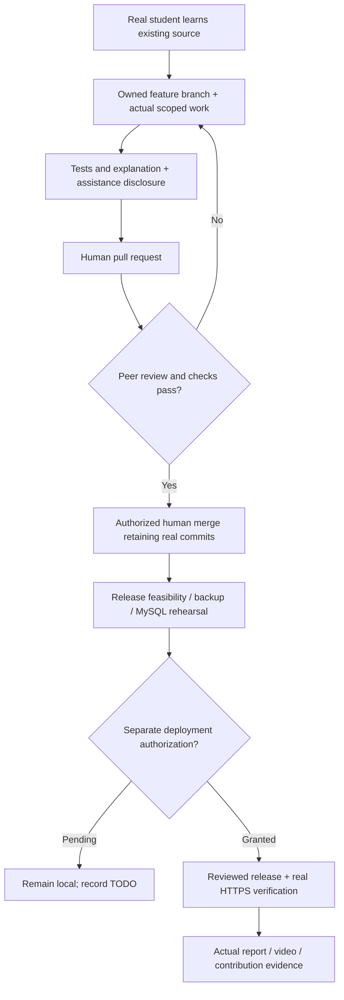

# 🔗 Human review → release

```mermaid
flowchart TD
    A[Real student learns existing source] --> B[Owned feature branch + actual scoped work]
    B --> C[Tests and explanation + assistance disclosure]
    C --> D[Human pull request]
    D --> E{Peer review and checks pass?}
    E -->|No| B
    E -->|Yes| F[Authorized human merge retaining real commits]
    F --> G[Release feasibility / backup / MySQL rehearsal]
    G --> H{Separate deployment authorization?}
    H -->|Pending| I[Remain local; record TODO]
    H -->|Granted| J[Reviewed release + real HTTPS verification]
    J --> K[Actual report / video / contribution evidence]
```

This task stops at local reference material. No branch, PR, merge or deployment was created.
